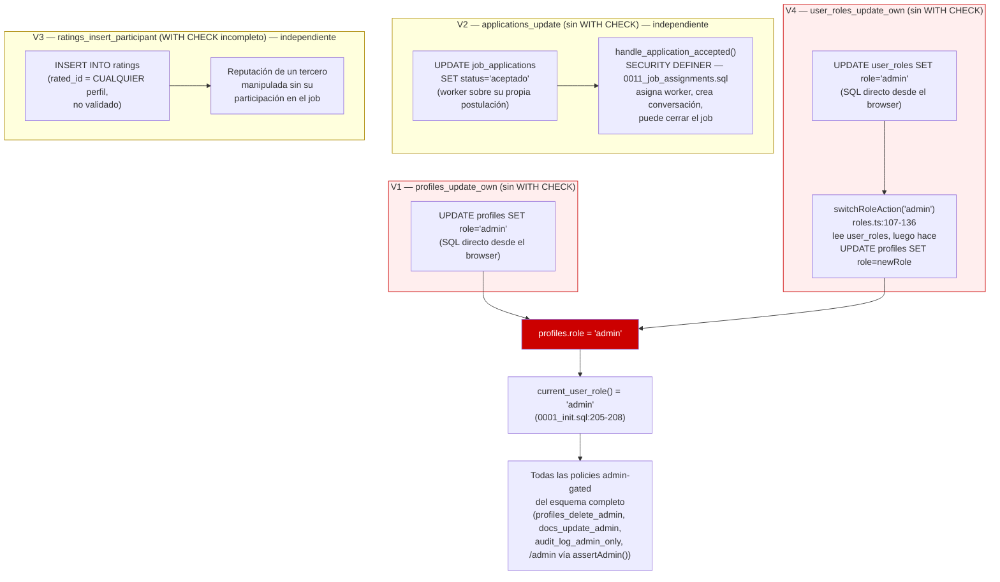

# Sprint v0.7 — Plan de corrección RLS (documento de diseño)

**Estado:** propuesta, pendiente de aprobación. Ningún código, migración o rama fue creada
para producir este documento.

**Alcance:** las 4 vulnerabilidades críticas de escalada de privilegios/falsificación de datos
confirmadas con evidencia empírica (exploit reproducido contra un Postgres 16 desechable,
aplicando las migraciones reales del repositorio) durante el barrido de políticas RLS del
28-30 julio 2026. No cubre los hallazgos de severidad Alta/Media/Baja del mismo barrido
(`assignments_update_participant`, `stats_update_own`, `jobs_update_owner_or_admin`,
`history_insert_participant`, `conversations_insert_employer`) — quedan registrados en la
sección 19 para un sprint posterior, conforme al principio de "un objetivo por rama" (§7/§23).

---

## 1. Resumen ejecutivo

El barrido de las 11 migraciones (`0001`→`0011`) encontró **4 políticas RLS críticas** que
comparten una misma falla estructural: permiten `UPDATE`/`INSERT` sobre una fila validando
**quién** la toca, pero no **qué valor** escribe en las columnas sensibles de esa fila. Las
cuatro habilitan, directa o indirectamente, que un usuario sin privilegios obtenga rol de
administrador, se autocontrate en un trabajo, o falsifique una calificación de reputación
contra cualquier perfil del sistema.

Dos de las cuatro (`profiles_update_own` y `user_roles_update_own`) no son independientes:
comparten la misma causa raíz y **el mismo objetivo de ataque** (convertirse en admin), a
través de dos caminos distintos hacia el mismo resultado. Las otras dos
(`applications_update`, `ratings_insert_participant`) son independientes entre sí y de las
primeras dos, con objetivos de ataque distintos (autocontratación; reputación falsa).

Ninguna de las cuatro requiere cambio de esquema (columnas/tablas nuevas) — las cuatro se
corrigen exclusivamente reescribiendo la cláusula `WITH CHECK` de una política ya existente.
Esto mantiene el radio de cada migración mínimo y el rollback trivial (`DROP POLICY` +
recrear la versión anterior, una sola sentencia).

## 2. Las 4 vulnerabilidades

### V1 — `profiles_update_own` — Escalada de privilegios de administrador (🔴 Crítico)

- **Tabla / policy:** `public.profiles` / `profiles_update_own` (`UPDATE`)
- **Definición:** `supabase/migrations/0001_init.sql:225-228`
- **`USING`:** `auth.uid() = id OR current_user_role() = 'admin'`
- **`WITH CHECK`:** ausente → Postgres reutiliza `USING` sobre la fila resultante; como `id`
  no cambia, la condición sigue cumpliéndose sin importar qué otra columna se modifique.
- **Explotación confirmada:** un `worker` ejecuta
  `supabase.from('profiles').update({role:'admin'}).eq('id', auth.uid())` desde el cliente
  browser (misma anon key + sesión que usa la app) y la fila queda con `role='admin'`.
  Verificado con `UPDATE 1` contra un Postgres real bajo RLS, sin bypass de superusuario
  (`rolbypassrls=false` en el rol `authenticated`).
- **Impacto:** `current_user_role()` (`0001_init.sql:205-208`) es la función que consumen
  **todas** las demás políticas admin-gated del esquema (`profiles_delete_admin`,
  `docs_update_admin`, `audit_log_admin_only`, rutas `/admin` vía `assertAdmin()`). Escalar
  aquí equivale a admin total de la plataforma, no solo de la fila propia.

### V2 — `applications_update` — Autocontratación (🔴 Crítico)

- **Tabla / policy:** `public.job_applications` / `applications_update` (`UPDATE`)
- **Definición:** `supabase/migrations/0001_init.sql:283-289`
- **`USING`:** `auth.uid() = worker_id OR auth.uid() ∈ employer_id(job) OR admin`
- **`WITH CHECK`:** ausente → mismo patrón que V1: `worker_id` no cambia, así que la
  condición se sigue cumpliendo tras el `UPDATE` sin importar el nuevo `status`.
- **Server Action que no protege nada por sí sola:** `updateApplicationStatus`
  (`src/lib/actions/jobs.ts:261-281`) valida el enum del nuevo estado con Zod pero **nunca
  valida que el llamante sea el empleador dueño del job** — depende por completo de la RLS
  para esa restricción, y la RLS es justo la que falla.
- **Explotación:** un worker llama directamente
  `job_applications.update({status:'aceptado'}).eq('id', suPropiaPostulacion)`. El trigger
  `handle_application_accepted()` (`SECURITY DEFINER`, redefinido en
  `0011_job_assignments.sql:93-...`) se dispara igual, asigna `jobs.assigned_worker_id`,
  crea la conversación y, si cubre las vacantes, cierra el job — todo sin que el empleador
  haya aceptado nada.
- **Camino seguro que ya existe:** `hireWorker()` (`src/lib/actions/applications.ts:112-166`)
  sí valida ownership vía `loadOwnedApplication()` antes de aceptar. El problema no es que
  falte lógica de negocio — es que la RLS no obliga a pasar por ella.

### V3 — `ratings_insert_participant` — Calificación falsificada contra cualquier perfil (🔴 Crítico)

- **Tabla / policy:** `public.ratings` / `ratings_insert_participant` (`INSERT`)
- **Definición:** `supabase/migrations/0001_init.sql:297-306`
- **`WITH CHECK` existente:** valida `rater_id = auth.uid()` y que el rater sea
  `employer_id` o `assigned_worker_id` del job — **pero nunca valida `rated_id`**, ni exige
  `jobs.status = 'completado'`.
- **Server Action que no protege nada por sí sola:** `submitRating`
  (`src/lib/actions/ratings.ts:7-66`) recibe `ratedId` como parámetro del cliente
  (línea 9/49) y lo inserta sin verificar que sea la contraparte real del job — solo deriva
  `rated_as_role` a partir de `ratedId`, sin validar el `ratedId` en sí.
- **Explotación:** cualquier empleador o worker con un job propio (activo o no) puede
  `ratings.insert({job_id: suJob, rater_id: auth.uid(), rated_id: CUALQUIER_PERFIL, score:1})`
  — daña la reputación de un tercero ajeno al job, o infla la propia con `score:5` desde una
  cuenta alterna que comparta un job cualquiera.
- **Nota:** esta es la única de las 4 donde `WITH CHECK` **sí existe** pero está incompleto
  — confirma que la mera presencia de `WITH CHECK` no es suficiente; debe cubrir cada
  columna sensible de la fila, no solo la de ownership del insertor.

### V4 — `user_roles_update_own` — Segunda vía de escalada, vía `switchRoleAction()` (🔴 Crítico)

- **Tabla / policy:** `public.user_roles` / `user_roles_update_own` (`UPDATE`)
- **Definición:** `supabase/migrations/0008_multi_role.sql:55-58`
- **`USING`:** `auth.uid() = user_id`
- **`WITH CHECK`:** ausente. Compárese con `user_roles_insert_own`
  (`0008_multi_role.sql:47-53`), que sí exige `role::text in ('worker','employer')` — la
  misma restricción **no se replicó** en la policy de `UPDATE`.
- **Por qué es crítica aunque `current_user_role()` no lee esta tabla:** `current_user_role()`
  lee `profiles.role`, no `user_roles.role` (comentario explícito en
  `0008_multi_role.sql:8-10`), así que forjar `user_roles.role='admin'` no otorga nada *por
  sí solo* hoy. Pero habilita un segundo camino hacia V1:
  1. El atacante ejecuta `user_roles.update({role:'admin'}).eq('user_id', auth.uid())`
     — aceptado porque la policy no lo impide.
  2. El atacante llama al Server Action legítimo `switchRoleAction('admin')`
     (`src/lib/actions/roles.ts:107-136`), que en la línea 117-123 consulta `user_roles`
     buscando una fila `role='admin', active=true` para ese usuario — **la encuentra**,
     porque el paso 1 la forjó.
  3. `switchRoleAction` ejecuta `profiles.update({role:'admin'})` (línea 127-130) **como el
     propio usuario no-admin** — el mismo `UPDATE` que V1 describe, ahora disparado por una
     función de la propia aplicación en vez de SQL crudo desde la consola.
- **Landmine adicional:** `user_has_role()` (`0008_multi_role.sql:78-86`, `SECURITY DEFINER`)
  lee `user_roles` y hoy no se usa en ninguna otra policy ni Server Action (confirmado por
  grep en el repo completo) — pero si código futuro empieza a confiar en ella para gatear
  algo, el registro forjado le otorgaría privilegio real inmediatamente, sin tocar `profiles`.

## 3. Diagrama de interacción



**Lectura del diagrama:** V1 y V4 convergen en el mismo resultado (`profiles.role='admin'`),
por dos caminos distintos — de ahí que deban diseñarse coordinadamente aunque no
necesariamente en el mismo PR (ver §5-§6). V2 y V3 no tienen conexión con V1/V4 ni entre sí:
son fallas independientes, cada una con su propio objetivo de ataque.

## 4. Causa raíz compartida

Las 4 comparten la **misma causa raíz mecánica**: una política `UPDATE`/`INSERT` que
restringe el acceso por *ownership de fila* (`auth.uid() = <columna_dueño>`) sin restringir
los *valores* que esa fila puede tomar tras la operación. En Postgres, `UPDATE` sin
`WITH CHECK` reutiliza `USING` — que solo referencia la columna de ownership — de modo que
cualquier otra columna queda sin protección de facto.

Sobre esa causa raíz común, hay **dos objetivos de ataque distintos**:

| Objetivo de ataque | Vulnerabilidades |
|---|---|
| Obtener `role='admin'` | V1, V4 (mismo objetivo, dos caminos) |
| Falsificar el estado/dato de un recurso ajeno sin ser admin | V2 (estado de postulación), V3 (reputación de terceros) |

## 5. ¿Cuáles pueden corregirse en el mismo PR sin romper el protocolo?

**V1 + V4 — sí, son candidatas defendibles para un mismo PR**, con esta justificación
explícita para no violar §19/§20 por accidente:

- §19 prohíbe mezclar vulnerabilidades **distintas** en un PR; V1 y V4 no son vulnerabilidades
  distintas en el sentido que la regla busca prevenir (funcionalidades no relacionadas
  acumuladas por conveniencia) — son **el mismo vector de ataque con dos entradas**, contra
  el mismo objetivo (`profiles.role='admin'`), en la misma capa (RLS del sistema de roles).
- §20 prohíbe mezclar **capas críticas distintas**; `profiles` y `user_roles` no son capas
  distintas — ambas son la capa "RLS de autorización de rol", la misma unidad de auditoría.
- Corregir solo una de las dos deja una ambigüedad de seguridad real (ver §9 más abajo), algo
  que el protocolo busca evitar tanto como evitar PRs sobrecargados.

Esto es una **recomendación**, no una decisión tomada — la alternativa (separarlas) se
describe en §6-§7 y es igual de válida si prefieres la lectura más literal de §19.

**No hay otra combinación defendible.** V2 y V3 no comparten causa raíz de exploit con V1/V4
más allá del patrón mecánico general (que es demasiado amplio como criterio de agrupación —
agruparía las 4, violando §19 en su sentido literal). V2 y V3 tampoco comparten objetivo de
ataque entre sí, así que no deben combinarse entre ellas ni con V1/V4.

## 6. ¿Cuáles deben ir en PR separados?

- **V2 (`applications_update`)** — PR propio. Objetivo de ataque (autocontratación) y tabla
  (`job_applications`) distintos de V1/V4/V3.
- **V3 (`ratings_insert_participant`)** — PR propio. Objetivo de ataque (reputación falsa) y
  tabla (`ratings`) distintos de las demás.
- Si se opta por la lectura literal de §19 en vez de la recomendación de §5, **V1 y V4
  también van en PRs separados**, en ese orden estricto (ver §7) para que el PR de V1 cierre
  el vector de ataque completo por sí solo antes de que exista una ventana de riesgo.

## 7. Orden recomendado de implementación

1. **V1 — `profiles_update_own`.** Primero porque su radio de impacto (admin total del
   sistema) es el mayor de los cuatro, y porque **su diseño debe cerrar el vector completo**:
   la condición debe rechazar específicamente `new.role = 'admin'` cuando el actor no es ya
   admin — no "bloquear cualquier cambio de `role`", que rompería el switch legítimo
   worker↔employer (`switchRoleAction`, ver §13). Con ese diseño, el `UPDATE profiles`
   disparado por `switchRoleAction('admin')` en el paso 3 del camino V4 queda bloqueado
   igual, **aunque `user_roles` siga sin corregir** — el riesgo de privilegio real desaparece
   con este PR, aunque el registro falso en `user_roles` (riesgo de integridad de datos, no
   de privilegio) siga latente hasta el PR 2.
2. **V4 — `user_roles_update_own`.** Cierra el registro falso que puede quedar en
   `user_roles` y neutraliza el riesgo latente sobre `user_has_role()`.
3. **V2 — `applications_update`.** Autocontratación; independiente, sin dependencia de 1-2.
4. **V3 — `ratings_insert_participant`.** Reputación falsa; independiente, sin dependencia de
   1-3. Se deja al final porque su explotación requiere que el atacante ya tenga un job propio
   como participante (fricción ligeramente mayor que V1/V2), no porque sea menos grave.

Si se sigue la recomendación de §5 (V1+V4 combinadas), el orden queda: **PR1 (V1+V4) → PR2
(V2) → PR3 (V3)**.

## 8. Dependencias entre ellas

- **V4 depende de V1** en el sentido de que el *diseño* del fix de V1 determina si V4 deja
  una ventana de privilegio real o solo un problema de integridad de datos. V1 debe
  implementarse con el patrón "rechazar valor `admin`", no con el patrón "congelar cualquier
  cambio de `role`" (ver §13) para que esta dependencia quede resuelta correctamente.
- **V2 y V3 no dependen de V1 ni de V4 ni entre sí.** Pueden implementarse en cualquier orden
  relativo entre ellas y en paralelo respecto a V1/V4, incluso en ramas distintas
  simultáneamente, sin conflicto — tocan tablas y funciones completamente distintas.
- Ninguna de las 4 depende de una migración de esquema previa; todas parten del esquema ya
  presente en `main` tras `0011_job_assignments.sql`.

## 9. Riesgos de corregirlas por separado

- **V1 antes que V4, con el diseño correcto (rechazar solo el valor `admin`):** riesgo bajo.
  La ventana entre el merge de V1 y el de V4 deja un registro *potencialmente* falso en
  `user_roles` como único residuo, sin traducirse en privilegio real, porque V1 ya bloquea el
  `UPDATE` final sobre `profiles` sin importar el origen de la llamada.
- **V4 antes que V1 (orden invertido):** riesgo medio — cerraría la vía indirecta
  (`switchRoleAction`) pero dejaría abierta la vía directa por SQL crudo sobre `profiles`
  (que es, de las dos, la más trivial de explotar). No se recomienda este orden.
- **V1 con el diseño incorrecto ("congelar cualquier cambio de `role`") antes que V4:** riesgo
  alto de **regresión funcional** — rompería `switchRoleAction` (worker↔employer) en
  producción antes de que V4 llegue a mergearse. Ver mitigación en §13/§16 (prueba de
  regresión obligatoria sobre el switch legítimo).
- **V2 o V3 corregidas por separado, en cualquier orden respecto a las demás:** riesgo bajo.
  Al no compartir tabla ni función con V1/V4, no dejan ventana cruzada. El único riesgo es
  organizacional (más PRs pequeños que rastrear), aceptado explícitamente por el protocolo
  (§19: "el objetivo es facilitar la auditoría... es la contrapartida intencional").

## 10. Riesgos de corregirlas juntas

Aplica solo si se opta por la combinación V1+V4 (§5) — nunca se recomienda combinar con V2 o
V3, cuyo riesgo de combinación sería alto por mezclar objetivos de ataque no relacionados
(auditoría confusa, rollback parcial imposible sin revertir ambos fixes a la vez).

Para V1+V4 combinadas en un solo PR:

- **Riesgo de rollback acoplado:** si tras el merge aparece una regresión, revertir el PR
  revierte **ambas** políticas a la vez — aceptable aquí porque ambas vuelven exactamente al
  estado documentado en este mismo informe (no hay pérdida de granularidad real, ya que
  ambas ya están descritas como una sola unidad de ataque).
- **Riesgo de revisión:** un PR con 2 políticas es marginalmente más difícil de revisar línea
  por línea que uno con 1 — mitigado por el mini-audit exigido en §18, que debe cubrir ambas
  policies explícitamente y por separado dentro del mismo documento.
- **Riesgo de alcance:** debe vigilarse activamente que el PR no "aproveche" para tocar nada
  más de `user_roles` o `profiles` (columnas, índices, otras policies) — el diff debe
  limitarse estrictamente a las dos cláusulas `WITH CHECK`.

## 11. Estrategia de rollback

Común a las 4 (y a la combinación V1+V4): cada migración de corrección es
`DROP POLICY ... ; CREATE POLICY ...` sobre una política **ya existente**, nunca una
alteración de esquema. El rollback es siempre:

```sql
-- Rollback genérico: recrear la versión documentada en este archivo,
-- sección 2, para la policy afectada (USING sin WITH CHECK).
drop policy "<nombre_policy>" on public.<tabla>;
create policy "<nombre_policy>" on public.<tabla>
  for <update|insert>
  using (<expresión USING original, ver §2>);
  -- (o with check (<expresión original>) para las INSERT)
```

- Una sola sentencia SQL por policy, sin pérdida de filas ni de datos — el rollback es
  instantáneo y no requiere downtime.
- Antes de aplicar cada migración en Supabase (acción del owner, nunca del agente, conforme
  a §11), se debe crear un tag de seguridad (`v0.6.x-pre-rls-v1`, `-pre-rls-v4`, etc., §14/§25).
- El rollback de rama/PR es el estándar de git (`git revert`) — no aplica a la base de datos
  hasta que el SQL generado se aplique manualmente en Supabase.

## 12. Pruebas que deberán pasar

Ninguna prueba automatizada existe hoy en el repo (`ESTADO-PROYECTO-v0.6.0.md`: "no hay test
runner ni CI"). Para este sprint, "pruebas de regresión" significa **scripts SQL
reproducibles** ejecutados contra un Postgres desechable (mismo método que la prueba de
explotación ya realizada), documentados y guardados junto a cada PR, más verificación manual
de la UI. Cada PR debe incluir, como mínimo:

**Para V1 (`profiles_update_own`):**
- ❌ Un `worker` NO puede `UPDATE profiles SET role='admin'` sobre su propia fila.
- ❌ Un `worker` NO puede `UPDATE profiles SET is_active=true` si estaba suspendido por un
  admin.
- ✅ Un `worker` SÍ puede seguir editando `bio`, `phone`, `city`, `category`, `skills` de su
  propio perfil (regresión de `updateProfile`, `src/lib/actions/profile.ts:26-52`).
- ✅ Un `admin` real SÍ puede seguir cambiando `role`/`is_active` de cualquier perfil.
- ✅ **Regresión crítica:** `switchRoleAction('employer')` y `switchRoleAction('worker')`
  (`src/lib/actions/roles.ts:107-136`) siguen funcionando para un usuario con ambos roles
  activos en `user_roles`.

**Para V4 (`user_roles_update_own`):**
- ❌ Un `worker` NO puede `UPDATE user_roles SET role='admin'` sobre su propia fila.
- ✅ Un `worker` SÍ puede seguir usando `enableEmployerRole()`/`disableEmployerRole()`
  (`src/lib/actions/roles.ts:35-101`), que dependen de `upsert`/`update` sobre `active`, no
  sobre `role`.
- ✅ **Regresión combinada V1+V4:** con ambas políticas corregidas, el flujo completo
  registro → `enableEmployerRole()` → `switchRoleAction('employer')` → `switchRoleAction('worker')`
  sigue funcionando de punta a punta.

**Para V2 (`applications_update`):**
- ❌ Un `worker` NO puede `UPDATE job_applications SET status='aceptado'` en su propia
  postulación.
- ✅ Un `worker` SÍ puede seguir retirando su propia postulación (`withdrawApplication`,
  `src/lib/actions/jobs.ts:159-...`, transición a estado de retiro).
- ✅ El empleador SÍ puede seguir aceptando vía `hireWorker()`
  (`src/lib/actions/applications.ts:112-166`) y rechazando vía `rejectApplication()`
  (línea 168).
- ✅ El trigger `handle_application_accepted()` sigue disparando correctamente cuando el
  cambio a `aceptado` viene del empleador.

**Para V3 (`ratings_insert_participant`):**
- ❌ Un participante de un job NO puede `INSERT` una calificación con `rated_id` de un
  perfil ajeno al job.
- ❌ No se puede calificar un job que no está `completado` (si se decide incluir esa
  restricción — a confirmar con el owner antes de implementar, ya que endurece el
  comportamiento actual más allá del gap original).
- ✅ El flujo normal de `submitRating` (`src/lib/actions/ratings.ts:7-66`) sigue funcionando
  para la contraparte real del job, en ambos sentidos (empleador→worker y worker→empleador).

**Todas las migraciones, además:**
- `npx tsc --noEmit` limpio.
- `npm run lint` limpio.
- `npm run build` limpio.
- Verificación manual en navegador de que el flujo afectado (perfil, cambio de rol,
  postulación, calificación) sigue funcionando para el camino legítimo, conforme a la
  sección "For UI or frontend changes" de las instrucciones del agente.

## 13. Impacto esperado sobre el código existente

- **Cero cambios de código TypeScript son necesarios.** Las 4 correcciones son enteramente
  a nivel de base de datos (políticas RLS). Ningún Server Action ni componente necesita
  reescribirse para que el sistema quede seguro — es, en sí, la evidencia de que el gap
  siempre fue de la capa RLS y no de la capa de aplicación.
- El único riesgo de impacto es una **regresión de un flujo legítimo que hoy depende,
  sin saberlo, del mismo permiso amplio que se está cerrando** — el caso ya identificado es
  `switchRoleAction` (§9, §12). No se identificó ningún otro flujo legítimo que dependa de
  escribir `role`/`is_active` (profiles), `role` (user_roles), `status='aceptado'` como
  worker (job_applications), o `rated_id` arbitrario (ratings).
- No se tocan índices, constraints, ni la forma de ninguna tabla — `pg_dump --schema-only`
  antes/después de cada migración debe diferir únicamente en la definición de la policy
  corregida.

## 14. Server Actions que deberán revisarse

No se espera modificarlas, pero cada una debe **probarse contra la política corregida**
porque son las que ejercitan el camino legítimo que no debe romperse:

| Server Action | Archivo | Por qué se revisa |
|---|---|---|
| `updateProfile` | `src/lib/actions/profile.ts:26-52` | Camino legítimo de V1 (no toca `role`, debe seguir funcionando) |
| `switchRoleAction` | `src/lib/actions/roles.ts:107-136` | Depende directamente del diseño de V1 y de V4 (§9, §13) |
| `enableEmployerRole` / `disableEmployerRole` | `src/lib/actions/roles.ts:35-101` | Escriben `user_roles.active`, deben seguir funcionando tras el fix de V4 |
| `hireWorker` | `src/lib/actions/applications.ts:112-166` | Camino legítimo de V2 (acepta postulaciones como empleador) |
| `rejectApplication` | `src/lib/actions/applications.ts:168-...` | Camino legítimo de V2 |
| `withdrawApplication` | `src/lib/actions/jobs.ts:159-...` | Camino legítimo de V2 (worker retira su propia postulación) |
| `updateApplicationStatus` | `src/lib/actions/jobs.ts:261-281` | Ruta antigua sin validación de llamante — no se elimina en este sprint (fuera de alcance por §19, ya que eliminarla no es un fix de RLS sino un refactor de código), pero queda **documentada como debe-retirarse** en un sprint posterior |
| `submitRating` | `src/lib/actions/ratings.ts:7-66` | Camino legítimo de V3; verificar que sigue insertando correctamente tras endurecer `WITH CHECK` |

## 15. Componentes UI que podrían verse afectados

Ninguno requiere cambios de código, pero deben **probarse manualmente** tras cada fix porque
consumen los Server Actions de la tabla anterior:

- `src/app/dashboard/worker/profile/` (o equivalente) — formulario de edición de perfil (V1).
- Selector/switch de rol en la navegación (`Navbar`/`BottomNav` o panel de ajustes) que
  invoca `switchRoleAction` (V1, V4).
- Panel de "Configuración" o similar donde vive `enableEmployerRole`/`disableEmployerRole`
  (V4).
- Vista del empleador sobre postulantes — botones de aceptar/rechazar que llaman a
  `hireWorker`/`rejectApplication` (V2).
- Vista del worker sobre sus postulaciones — botón de retirar postulación (V2).
- Modal o formulario de calificación al finalizar un trabajo, que invoca `submitRating` (V3).

## 16. Checklist de validación antes del merge

Para cada PR (V1, V4, V2, V3 — o V1+V4 combinado según se decida en §5):

- [ ] Rama creada desde `main` actualizado, un único objetivo (§7/§23).
- [ ] Checkpoint commit antes de tocar cualquier archivo (§3).
- [ ] Una única migración SQL nueva, numerada secuencialmente (`0012_...`, `0013_...`, etc.),
      que solo contiene `DROP POLICY`/`CREATE POLICY` para la(s) política(s) en alcance de
      ese PR — ningún otro `ALTER`/`CREATE TABLE`/cambio de esquema.
- [ ] Pruebas de regresión SQL de la sección 12 ejecutadas contra un Postgres desechable con
      las migraciones reales aplicadas, con capturas/logs adjuntos al PR.
- [ ] `npx tsc --noEmit` limpio.
- [ ] `npm run lint` limpio.
- [ ] `npm run build` limpio.
- [ ] Verificación manual en navegador del/de los flujo(s) legítimo(s) de la sección 15.
- [ ] Mini Security Audit completo (sección 18) incluido en la descripción del PR.
- [ ] Informe de pre-merge conforme a §21 del protocolo (objetivo, archivos, líneas,
      riesgos, compatibilidad, resultado de TS/ESLint/Build, rollback, checkpoint, commit
      final).
- [ ] Sin conflictos con `main`.
- [ ] PR abierto, **sin merge** — esperando la frase exacta "MERGE APROBADO".

## 17. Checklist de validación después del deploy

Tras aplicar la migración en Supabase (acción del owner, §11) y una vez el PR esté
desplegado en el preview de Netlify o en producción:

- [ ] Re-ejecutar contra la base real (o su réplica de staging si existe) las mismas
      pruebas negativas de la sección 12 (intento de escalada/autocontratación/calificación
      falsa) y confirmar que son rechazadas.
- [ ] Confirmar en la UI real que los flujos legítimos de la sección 15 siguen funcionando
      con una cuenta de prueba worker y una employer.
- [ ] Revisar logs de Supabase (Postgres logs / API logs) en busca de un aumento anómalo de
      errores `42501` (violación de RLS) que indicaría que algún flujo legítimo no
      contemplado se rompió.
- [ ] Confirmar que ningún usuario existente en producción quedó con `role='admin'` o
      `is_active=true` de forma no explicable por el registro administrativo conocido
      (consulta de auditoría puntual, antes de dar el sprint por cerrado).
- [ ] Actualizar la sección "Decision log" de `CLAUDE.md` con el resultado real de cada PR
      (§5/§27), incluyendo el SHA final y el resultado de las pruebas post-deploy.
- [ ] Actualizar `CHANGELOG.md` (§6).

## 18. Security Audit que deberá acompañar cada PR

Conforme a §22 del protocolo, cada PR de este sprint — por tocar RLS/autorización — debe
incluir un mini-audit respondiendo estas 4 preguntas, una vez por cada política que el PR
modifique:

1. **¿Qué riesgo elimina?** — Describir el escenario de explotación exacto que deja de ser
   posible (referenciar la vulnerabilidad V1-V4 correspondiente de este documento).
2. **¿Qué riesgo introduce?** — Debe evaluarse explícitamente el riesgo de regresión sobre
   los flujos legítimos listados en la sección 14 de este documento para esa policy en
   particular; si la respuesta es "ninguno identificado", debe decir por qué (qué se probó
   para llegar a esa conclusión).
3. **¿Cómo se probó?** — Referenciar los scripts/resultados de la sección 12 ejecutados
   contra el Postgres desechable, más la verificación manual de UI de la sección 15.
4. **¿Cómo se revierte?** — Referenciar el rollback genérico de la sección 11, con el SQL
   exacto de la versión anterior de esa policy específica.

---

## 19. Hallazgos relacionados, fuera de alcance de este sprint

Registrados aquí para no perderlos (§27), detectados en el mismo barrido pero de severidad
Alta/Media y sin el mismo objetivo de ataque (escalada de rol/autocontratación/reputación) que
V1-V4, por lo que no deben mezclarse en las mismas ramas/PRs de este documento:

- `assignments_update_participant` (`job_assignments`, 🟠 Alto) — permite falsificar
  `agreed_pay`/`status`/`cancel_reason` sin pasar por `confirmAssignment`/`startAssignment`/
  `completeAssignment`/`cancelAssignment`.
- `stats_update_own` (`profile_stats`, 🟠 Alto) — permite autoasignarse `trust_score`/
  `badges` sin verificación real de documentos.
- `jobs_update_owner_or_admin` (`jobs`, 🟡 Medio) — el empleador dueño puede escribir
  `assigned_worker_id`/`status` directamente, saltándose el flujo de contratación.
- `history_insert_participant` (`job_state_history`, 🟡 Medio) — no valida que el actor sea
  participante del `job_id` referenciado; permite inyectar entradas de historial falsas en
  jobs ajenos.
- `conversations_insert_employer` (`conversations`, 🟢 Bajo) — no valida relación real entre
  `job_id`/`worker_id` y el empleador.

Recomendación: abrir un sprint v0.7.1 (o continuación de v0.7) exclusivamente para estos,
una vez cerrado el ciclo V1-V4, respetando el mismo formato de este documento.
